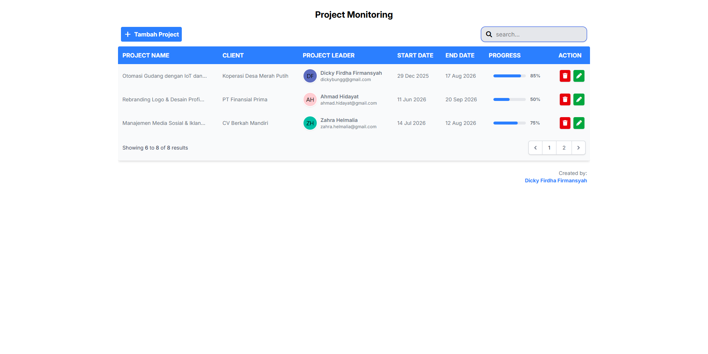
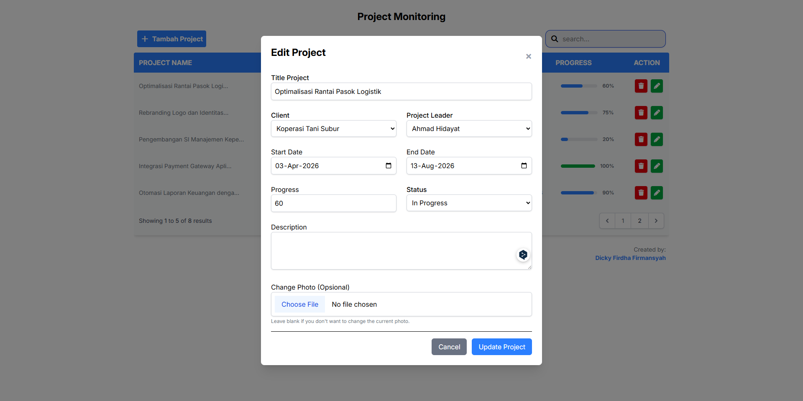
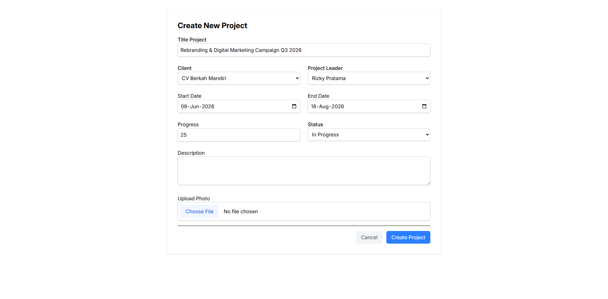
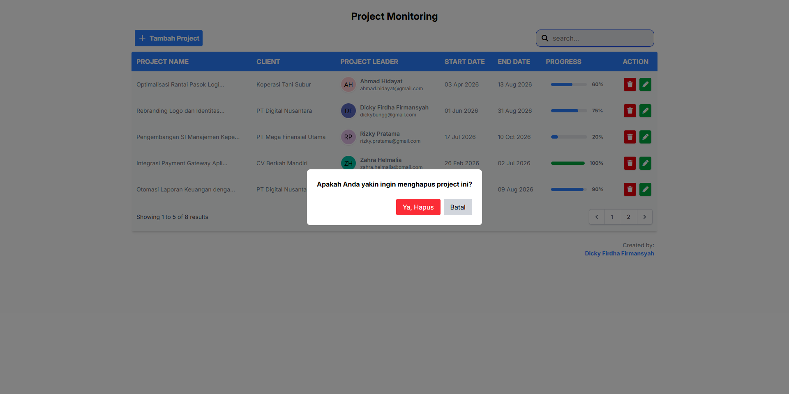
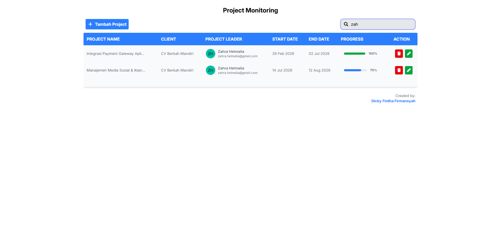

# Project Monitoring Dashboard 🚀

Aplikasi Sistem Informasi Project Monitoring yang modern, responsif, dan dinamis. Dibangun menggunakan **Laravel**, **Livewire v4**, dan **Tailwind CSS**. Project ini dikembangkan sebagai pemenuhan tugas teknis (tes rekrutmen).

## ✨ Fitur Unggulan

- **Pencarian Real-time (Live Search):** Menyaring project berdasarkan judul, nama klien, atau nama _project leader_ secara instan tanpa perlu me-_reload_ halaman.
- **Pagination Dinamis:** Navigasi data yang mulus dengan status _clean URL_ (tanpa parameter halaman di address bar).
- **CRUD Lengkap (Create, Read, Update, Delete):**
    - **Create:** Halaman khusus dengan form lengkap untuk menambahkan project.
    - **Read:** Tampilan tabel yang rapi dan responsif.
    - **Update:** Fitur _Edit_ interaktif menggunakan pop-up _Modal_.
    - **Delete:** Validasi _Modal_ konfirmasi yang aman sebelum menghapus data.
- **Manajemen File Cerdas (Upload Foto):** Mendukung _upload_ foto project. Foto lama akan otomatis terhapus dari server (auto-delete) saat project diubah atau dihapus agar folder _storage_ tidak menumpuk.
- **Dynamic Avatars:** Otomatis menghasilkan foto profil _Project Leader_ secara estetis (berdasarkan inisial nama).
- **Desain Responsif:** Tampilan antar muka (UI/UX) yang menyesuaikan dengan ukuran layar (Desktop, Tablet, maupun HP).

## 🛠️ Teknologi yang Digunakan

- **Backend:** Laravel 13
- **Frontend:** Livewire v4, Tailwind CSS, FontAwesome
- **Database:** MySQL

## 🚀 Panduan Instalasi (Getting Started)

### Persyaratan Sistem

- PHP >= 8.2
- Composer
- Node.js & NPM

### Langkah-langkah Menjalankan Aplikasi

1. **Clone repositori (atau ekstrak file project)**

    ```bash
    git clone <url-repository-anda>
    cd track-project
    ```

2. **Install Dependensi PHP**

    ```bash
    composer install
    ```

3. **Install Dependensi Node & Kompilasi Tailwind CSS**

    ```bash
    npm install
    npm run build
    ```

4. **Konfigurasi Environment**

    ```bash
    cp .env.example .env
    php artisan key:generate
    ```

    _Penting: Buka file `.env` di code editor Anda, lalu sesuaikan bagian `DB_DATABASE`, `DB_USERNAME`, dan `DB_PASSWORD` dengan koneksi database lokal Anda (misal: phpMyAdmin/XAMPP)._

5. **Jalankan Migrasi Database**

    ```bash
    php artisan migrate
    ```

6. **Buat Tautan Storage (Wajib!)**
   _Langkah ini krusial agar foto-foto yang di-upload ke sistem dapat ditampilkan di dalam browser._

    ```bash
    php artisan storage:link
    ```

7. **Jalankan Server Lokal**
    ```bash
    php artisan serve
    ```
    Buka browser Anda dan akses aplikasi pada tautan: `http://localhost:8000`

**Screenshoot Aplikasi**






## 👨‍💻 Pembuat (Author)

**Dicky Firdha Firmansyah**
